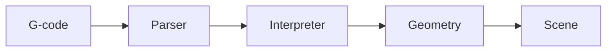

# Contributing

We are open to your ideas and always willing to get you started! [talk to us on Discord](https://discord.gg/w2bsGRE6S4).

Maybe there is an [open issue](https://github.com/xyz-tools/gcode-preview/issues?q=is%3Aissue%20state%3Aopen%20-label%3Ademo%20-label%3A3.1%2B%20-label%3Ablocked%20-label%3Arefactor) that appeals to you?

Other things that are always helpful:

- testing different gcode files, from different slicers
- reporting bugs! A screenshot or a minimal gcode snippet goes a long way
- making GCode Preview suitable for different printer types, like Deltas, Belt printers, IDEX, etc. Even CNC machines
- documentation & examples
- unit tests

## Development setup

Run the dev setup:

```sh
npm i
npm run dev
```

This runs the demo app which is fairly complete in using the library's features.
If you don't need the demo app, just run `npm run dev:watch`.

## Branches

`develop` is the default and integration branch. Open your PR against `develop` —
the unit-test CI and the Firebase preview deploy only trigger for PRs targeting it.
Merges to `develop` auto-deploy the demo to https://gcode-preview.web.app.

## Pull request templates

`.github/pull_request_template.md` is the default and loads automatically for
every PR. A few specialized templates live in `.github/PULL_REQUEST_TEMPLATE/`,
but GitHub does **not** offer a picker for them — pick one explicitly.

From the CLI:

```sh
gh pr create --base develop --template bugfix.md
```

Or append a query parameter to the compare URL:

```
https://github.com/xyz-tools/gcode-preview/compare/develop...my-branch?template=bugfix.md
```

| Template           | Use for                                                          |
| ------------------ | ---------------------------------------------------------------- |
| `bugfix.md`        | Fixing broken behavior — Problem / Cause / Fix, before & after   |
| `gcode-support.md` | New or updated gcode command support                             |
| `demo-ui.md`       | Demo app and UI changes — screenshots required                   |
| `performance.md`   | Speed or memory work — before/after numbers, output unchanged    |

Anything else (docs, refactors, dependency bumps) uses the default template.

## Writing a good PR description

The diff already shows *what* changed. The description is for everything the diff
can't show: why this change, why here, and what a reviewer would otherwise have to
reconstruct on their own.

**Don't list the changes.** A bullet per file or per function is the one thing
GitHub already renders perfectly. Spend that space on reasoning instead — the root
cause, the constraint that ruled out the obvious approach, the trade-off you took
knowingly.

**Draw it when it's structural.** GitHub renders Mermaid in PR descriptions. When a
change moves data between components, reorders a pipeline or introduces a new
lifecycle, a small diagram beats three paragraphs:



Diagram only the part you changed; a picture of the whole app helps nobody.

**Explain the math.** New geometry, projections, interpolation, coordinate
transforms or unit conversions need the reasoning written out — the formula, what
the variables mean, and why it's correct. A reviewer should be able to check your
derivation without redoing it from the code.

**Favor the description over verbose code comments.** Background, alternatives
considered and history belong in the PR, not in a comment block above the function.
Code comments should say what the next reader needs *at that line*; the story of how
the change came about belongs in the PR, which stays reachable from `git blame`.

**Delete what doesn't apply.** The templates are a starting point, not a form to
fill in. A heading with nothing under it, or a row of "N/A", costs the reviewer a
scroll and tells them nothing — drop the section entirely. The exception is a
change whose *absence* is the point: a performance PR that renders identically
should say so, because that claim is what's being reviewed.

## Before submitting a PR

Run the full check suite:

- `npm run test` for unit tests, or `npm run test:coverage` for the coverage-gated run CI uses
- `npm run typeCheck` for typescript typings
- `npm run lint` for code style and formatting
- `npm run build` for a production build
- or most of it together: `npm run check` (test + typeCheck + lint — note it does **not** run `build` or coverage)

To auto-fix simple issues: `npm run lint:fix` or `npm run prettier:fix`.

CI runs `build`, `test:coverage`, `typeCheck` and `lint` on Ubuntu with Node 22.
Note that CI uses `npm run test:coverage`, not `npm run test`: **every file under
`src/` must be at 100% statement/branch/function/line coverage** (see
`vitest.config.mts`), so run it locally before pushing.

The library supports `three` `>=0.166.0 <0.186.0`. PRs are checked against the
newest supported version; after merge, a matrix job re-runs the suite against
every supported three.js release. Avoid APIs that aren't available across that
whole range.

## AI usage

AI-assisted contributions are welcome, but usage of AI tools (Copilot, Claude,
ChatGPT, etc.) must be disclosed in the PR description. You remain responsible
for understanding and verifying everything you submit.

## Review standards

Every change, **intended or not**, must be:

1. **Documented and visible.** Behavior changes (including bug fixes that alter
   rendering/output for existing files) must be called out explicitly in the PR
   description, not buried in the diff.
2. **Truly covered by tests, in a convincing way.** Bug fixes should include
   regression tests: a test that fails before your change and passes after it.
3. **Tested end-to-end where applicable.** Supporting a new or updated gcode
   command requires at least one test that feeds a gcode snippet through the
   whole pipeline:
   `Parser.parseGCode` → `Interpreter.execute`, or the top-level entry points
   `GCodePreview.processGCode` / `processGCodeStream` (`src/gcode-preview.ts`).
   Hand-instantiated `GCodeCommand` objects only prove the handler logic; they don't
   prove the parser maps the command word to the handler.

General test expectations:

- Tests run on **vitest** (`vitest.config.mts`) in a `happy-dom` environment with
  globals enabled — no need to import `describe`/`test`/`expect`.
- Runtime tests live in `src/__tests__/`, mirroring the `src/` layout, as plain
  `.ts` files (e.g. `src/__tests__/interpreter.ts`) — they are **not** named
  `*.test.ts`, and files named that way won't be picked up.
- `src/__tests__/**/*.test-d.ts` files are compile-time type assertions; they run
  in the typecheck pass, not as runtime tests.
- Tests should exercise dispatch through `Interpreter.execute()` whenever the
  behavior depends on it (e.g. mode-flipping sequences like `G91` → move → `G90` →
  move), not just call individual handler methods directly.
- Keep changes focused. If a feature touches multiple behaviors, add regression
  coverage for each of them separately.


