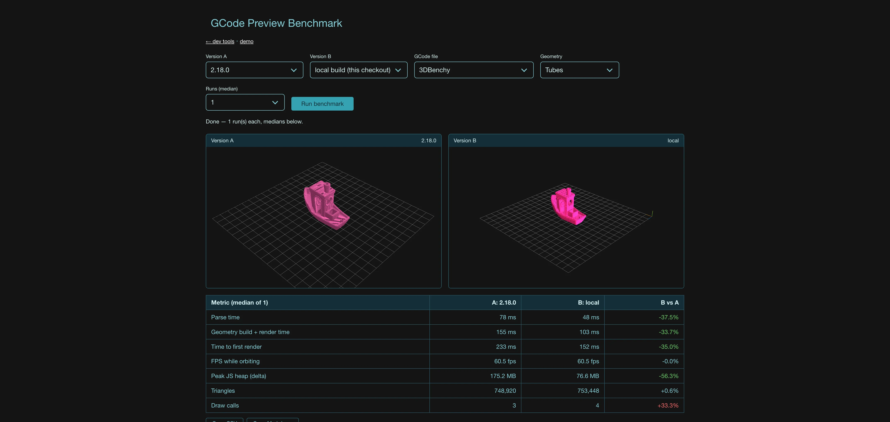
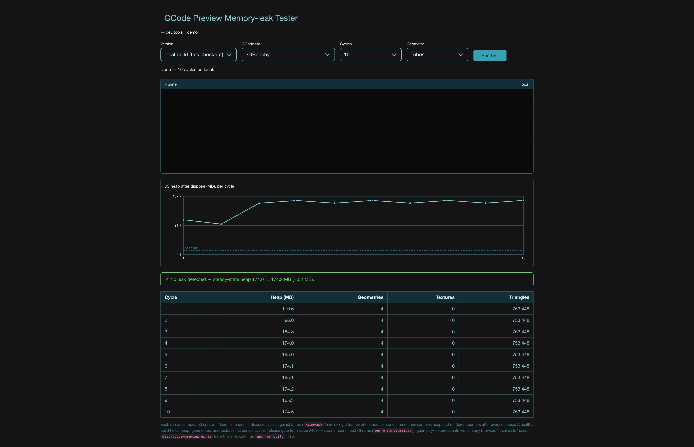
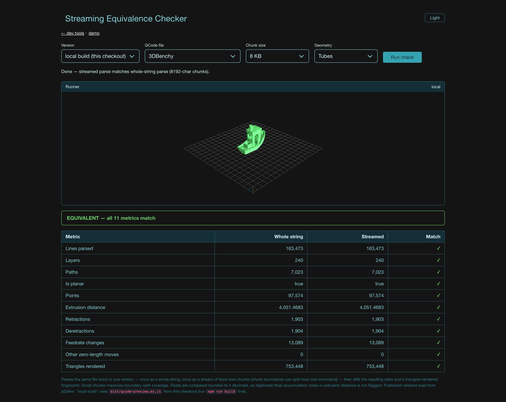
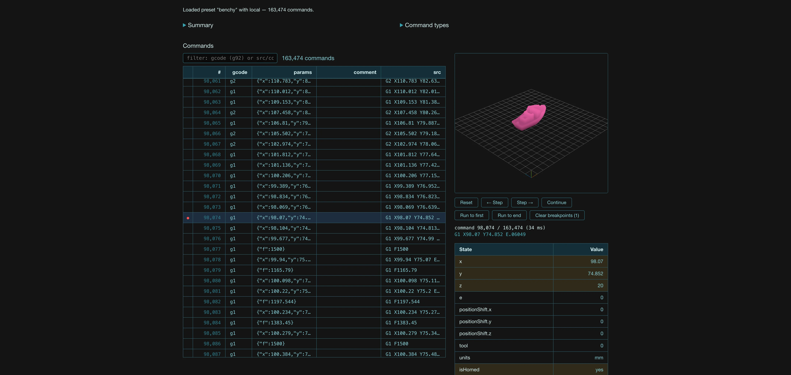
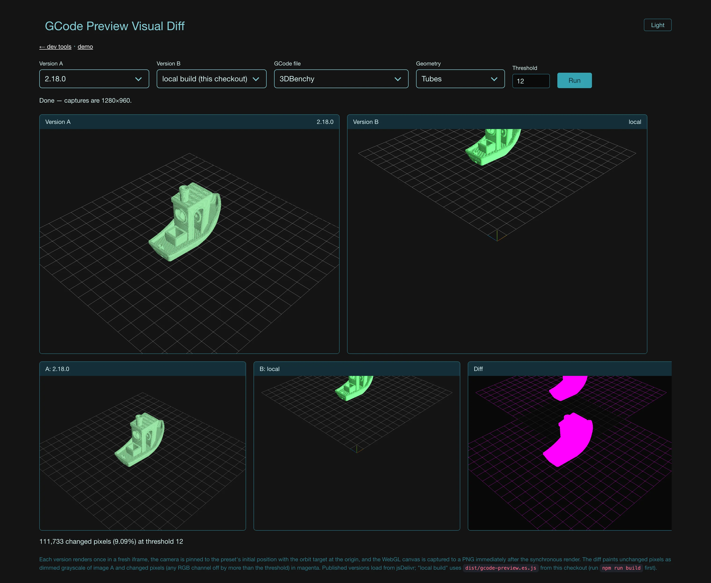

# Dev tools

Internal tooling for gcode-preview development. Unlike `demo/`, nothing in here is
deployed — these pages exist to help develop and release the library itself.

## Running

The demo dev server also serves this directory:

```
npm run dev          # or: npm run demo
```

then open <http://localhost:8080/devtools/>.

The pages reuse the demo's assets over the same server: `/style.css`, the preset
catalog (`/js/presets.js`), the bundled gcode files (`/gcodes/…`), and the local
library build (`/dist/gcode-preview.es.js` — produced by `npm run build`, or kept
fresh by `npm run dev`'s watcher).

## Shared infrastructure (`lib/`)

- `versions.js` — lists published versions from jsDelivr and builds a per-version
  import map (each release gets the three/lil-gui versions it was published
  against; `local` maps to `/dist`).
- `runner-frame.js` — runs a tool's runner script in a sandboxed iframe with its
  own import map, with a small postMessage protocol
  (`ready`/`phase`/`progress`/`result`/`error`).
- `preview-compat.js` — version-agnostic construction: 3.x `GCodePreview`
  (scene bits under `.sceneManager`) vs 2.x `WebGLPreview` (flat).
- `demo-presets.js` — the demo's preset catalog, file URLs, and merged display
  settings.

## Tools

### Benchmark (`benchmark/`)



Compares two versions of the library head-to-head on one of the demo gcode files,
for the release-gate benchmarks of issue #402: parse time, time to first render,
FPS while orbiting, and peak JS heap, plus geometry build time, triangles, and
draw calls.

Any published npm version (loaded from jsDelivr, with the three/lil-gui versions
that release was published against) can be compared against any other, or against
the local `dist/` build. Each version runs sequentially in a fresh sandboxed
iframe so runs cannot contaminate each other; runs are interleaved A/B and the
table reports medians. Results can be copied as CSV or Markdown.

Peak-heap numbers need Chrome (`performance.memory`); everything else works in
any browser.

### Memory-leak tester (`memory-leak/`)



Release-gate check: runs repeated create → load → render → dispose cycles
(fresh canvas each cycle, like a framework remount) and charts JS heap plus
`renderer.info.memory` per cycle. A regression over the tail of the run flags
"possible leak" vs "looks flat". Heap numbers need Chrome.

### Streaming equivalence checker (`streaming-equivalence/`)



Loads the same file twice in one version — once as a whole string, once as a
ReadableStream chunked at a configurable size (small chunks maximize
command-split-across-chunks coverage) — and diffs parser/job stats plus a
rendered-triangles fingerprint. Any mismatch is a parser streaming bug.

### Parser / interpreter inspector (`parser-inspector/`)



Load a preset or paste gcode and inspect the parse result: summary stats,
command-type histogram, and a paged, filterable command table (e.g. show only
`G92`s). Full inspection targets 3.x builds (2.x doesn't export the parser).

### Visual diff (`visual-diff/`)



Renders the same file in two versions with a pinned camera/target, captures
both canvases, and pixel-diffs them (changed pixels highlighted, % reported,
adjustable threshold). Catches rendering regressions that timing numbers miss.
